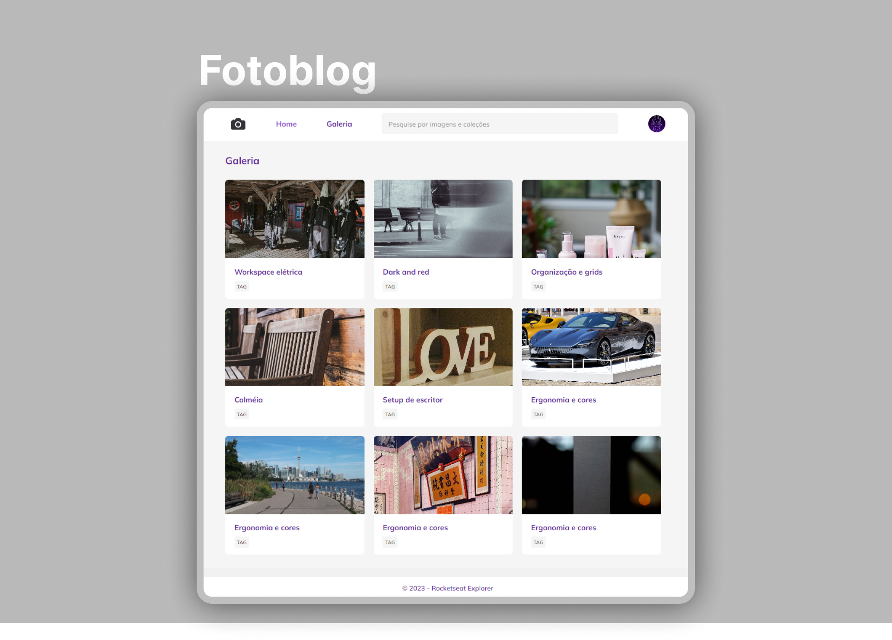

  

<h1 align="center">Página de Fotoblog. Projeto do Explorer - Rocketseat</h1>

 

  
  <a href="https://jlisarte.github.io/projeto_fotoblog/" target="_blank">https://jlisarte.github.io/projeto_fotoblog/</a>

## 🚀 Tecnologias

Esse projeto foi desenvolvido com as seguintes tecnologias:

- HTML e CSS
- Git e Github
- Figma

## 💻 Projeto

Esse projeto de galeria de fotos é desenvolvido no nível 03 do Explorer.

---

Feito por Shadowkhan - Juliano Lisarte
